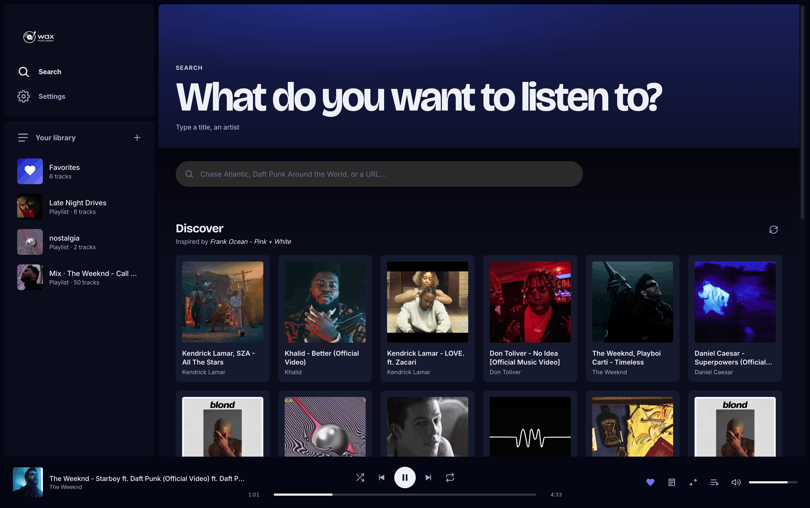
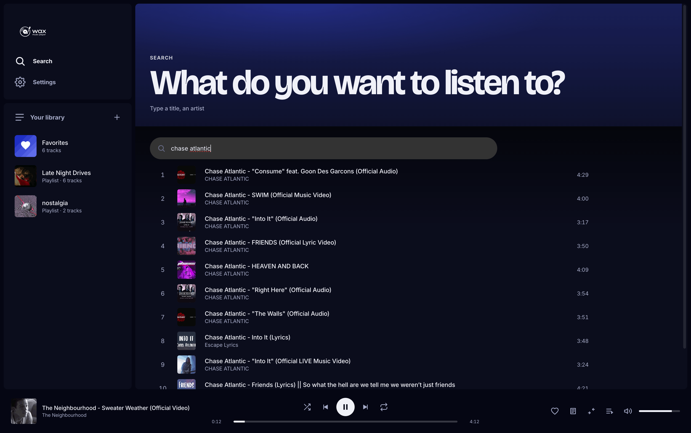
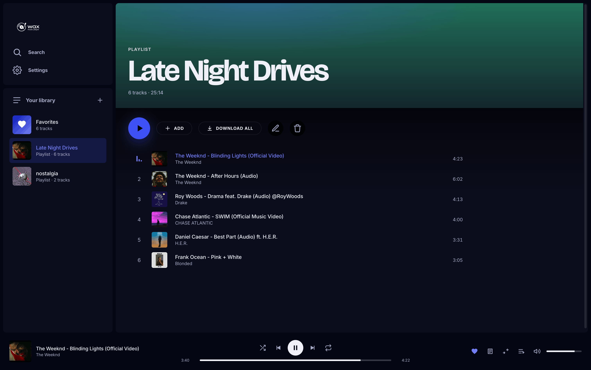
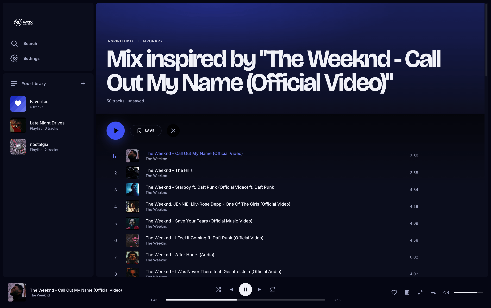
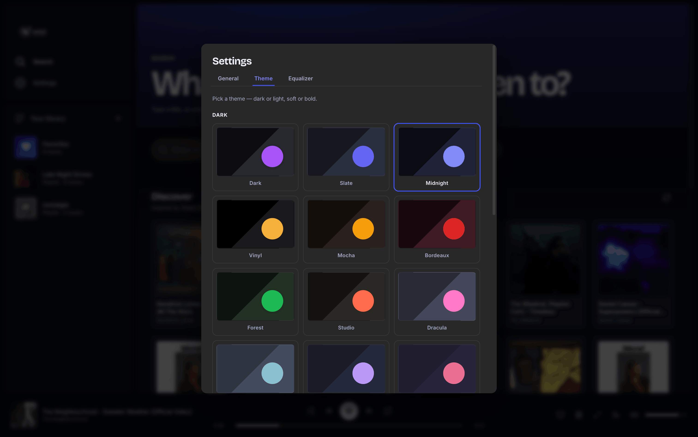

# Wax

<p align="center">
  
</p>

> A modern desktop YouTube → MP3 player. Stream by default, download for offline. Packaged Electron app for macOS / Windows / Linux.

> ⚠️ Wax is a personal client built on [`yt-dlp`](https://github.com/yt-dlp/yt-dlp). It hosts and redistributes nothing — every byte of audio is fetched at runtime by your own machine. Use it for content you own, content under permissive licenses, or content you have permission to download. YouTube's Terms of Service apply; copyright compliance is on you. See the full [Disclaimer](#disclaimer).

<p align="center">
  
</p>

## What it does

- **Search YouTube directly** in-app — results render as regular track rows (heart, mix, spinner, hover-prefetch all unified with the rest of the app)
- **Stream by default** — every track plays via `yt-dlp` URL extraction with 5h URL cache, hover prefetch, and "look-ahead one" on queue progression so transitions feel instant
- **Discover** — landing screen surfaces a YouTube Mix inspired by a random favorite, or the YouTube "Today's Top Hits" playlist when the library is empty; auto-refreshes when favorites change
- **Favoris vs Bibliothèque** — Favoris (heart-toggle) is the visible playlist; tracks added by saving a Mix or referenced by playlists live silently in the library so playlists keep working without polluting your favorites; "Nettoyer" button in Settings purges orphans
- **Download for offline** — per-track button converts a streamed favorite into a local MP3 320 kbps with circular progress ring; the ✓ indicator turns into × on hover to remove the local file
- **Playlists** — create, rename, delete, drag-reorder, bulk-add modal, "Tout télécharger" cascade
- **Drag-and-drop** — drag any track (search result, Découverte card, library row) onto a sidebar playlist or onto Favoris to add it; duplicates are blocked with a toast
- **Mix inspired by this track** ("Spotify Radio" equivalent) — generates a 50-track stream queue from YouTube's `RD<videoId>` mix; "Sauvegarder" turns the temporary mix into a permanent playlist *without* downloading the songs (they stay streamable references)
- **Audio player** with shuffle / repeat / queue panel / crossfade / lyrics (via lyrics.ovh) / OS media controls (MediaSession API) / "Add to queue" on every row / robust stream-error handling (toast + auto-skip)
- **3-band equalizer** — bass / mid / treble (±12 dB) via Web Audio BiquadFilters, persisted in prefs
- **Themes** — 22 presets in Settings, grouped by family. **14 sombres** (Sombre, Ardoise, Minuit, Vinyle, Moka, Bordeaux, Forêt, Studio, Dracula, Nord, Tokyo Night, Rose Pine, Gruvbox, Néon) and **8 clairs** (Papier, Lin, Crème, Sable, Pêche, Menthe, Glacier, Lavande). Crème is the default light: soft warm cream, low-glare for long sessions. Each theme drives its own modal/pill backgrounds so the app stays cohesive end-to-end. All persist across sessions.
- **Audio-reactive visualizer** on the currently-playing track row (FFT split into bass / mid / high; sqrt curve for sensitivity)
- **Offline-first covers** — every cover goes through `/api/cover/:ytId`: served from `library/covers/<ytId>.jpg` if cached, otherwise fetched once from YouTube (maxres → hq → mq → default), saved to disk, and served. Once cached, covers work fully offline. Tracks downloaded for offline pre-fetch their cover automatically. A neutral SVG placeholder kicks in if every variant 404s
- **Loading shimmer + spinners** — shimmer skeleton cards on Découverte / Top, spinners on tracks during buffering — no more "did my click work?" anxiety
- **In-app rename** — pencil button on every library track opens a prompt modal to retitle (PATCH `/api/library/:id`)
- **Artist pages** — every track row's artist name is clickable; navigates to a hero view with the artist's avatar (scraped from their official YouTube channel via yt-dlp + `og:image` fallback, cached on disk), every library track by them, and a "More from this artist" recommendations row pulled from YouTube. One-click "Add all to favorites" batches every recommendation into the library. Names are parsed from the YouTube title (`"Artist - Song"` patterns), with fallback to the channel uploader. Channel suffixes like `VEVO` / `Official` / `- Topic` are normalized so the same artist regrouped across channels lands on one page
- **yt-dlp queue indicator** — pulsing badge in the sidebar shows active + queued background downloads
- **Persisted state** — queue, position, shuffle/repeat, volume, theme, EQ all restored on reload
- **Bilingual UI** — English / Français picker in Settings; switches on the fly without a reload (every label, toast, modal, hero, theme name)
- **Tabbed Settings** — General / Theme / Equalizer; the General tab covers crossfade (toggle + duration slider), language, backup, library cleanup
- **Backup & restore** — one-click export of library + playlists + preferences into a single JSON file, and one-click import (with confirmation) to restore on a fresh install or roll back. Audio MP3s aren't bundled — copy `library/audio/` separately for full offline migration

## Screenshots

<table>
  <tr>
    <td width="50%"></td>
    <td width="50%"></td>
  </tr>
  <tr>
    <td><strong>Search YouTube in-app</strong> — type a track or paste a URL, results render as full track rows.</td>
    <td><strong>Build playlists, drag tracks around</strong> — drag-reorder, bulk-add, download all.</td>
  </tr>
  <tr>
    <td></td>
    <td></td>
  </tr>
  <tr>
    <td><strong>Mix radio</strong> — click ✨ on any track to generate a 50-track inspired queue.</td>
    <td><strong>22 themes</strong> — dark + light, including Dracula, Nord, Tokyo Night, Rose Pine.</td>
  </tr>
</table>

## Stack

| Layer | Tech |
|---|---|
| Frontend | Vue 3 (Composition API, `<script setup>`) + Pinia + Vite |
| Backend | Express 4 (Node 18+) — REST + SSE for download progress |
| Desktop | Electron 33 + electron-builder (DMG / NSIS / AppImage) |
| Audio | HTMLAudioElement + Web Audio API (AnalyserNode + BiquadFilter chain for EQ) |
| Extraction | yt-dlp (subprocess) for stream URLs and downloads |
| Conversion | ffmpeg (called by yt-dlp) for MP3 320 kbps encoding |
| Fonts | Inter (body) + Bricolage Grotesque (display, hero h1) |

## Install & dev

Prerequisites: **Node 18+**, **yt-dlp**, **ffmpeg** on `PATH`.

**macOS**

```bash
brew install yt-dlp ffmpeg
```

**Debian / Ubuntu**

```bash
sudo apt install yt-dlp ffmpeg
```

(Or `pip install yt-dlp` if your distro is behind on packaging.)

Then:

```bash
git clone https://github.com/dgadacha/wax.git
cd wax
npm install
npm run dev
```

`npm run dev` runs Vite (port 5173) + Express (port 3000) + Electron, with HMR.

## Build for distribution

```bash
npm run dist:mac
npm run dist:win
npm run dist:linux
```

Outputs:

- `dist:mac` → `release/Wax-{version}.dmg` (arm64 + x64)
- `dist:win` → `release/Wax-Setup-{version}.exe` (NSIS)
- `dist:linux` → `release/Wax-{version}.AppImage`

Required assets (drop into `build/`):
- `build/icon.icns` — macOS app icon (1024×1024 source recommended)
- `build/icon.ico` — Windows app icon
- `build/icon.png` — Linux fallback (512×512)

For signed/notarized builds (Mac App Store or trusted distribution outside it), set up `electron-builder.yml` with your team ID + Apple ID env vars. The current config produces unsigned artifacts — fine for local use, will trigger Gatekeeper warnings for end users.

The `extraResources` block in `electron-builder.yml` is wired to bundle yt-dlp + ffmpeg binaries from `build/bin/<os>/<arch>/` if you drop them there. Otherwise the app falls back to the system PATH at runtime (which only works if the user has them installed).

## Architecture (high-level)

```
┌──────────────────────────────────────────────────────────────┐
│                     Electron main process                    │
│  electron/main.cjs                                            │
│    ├─ forks server.js as child (PORT=3000)                   │
│    └─ creates BrowserWindow → loads localhost:5173 (dev)     │
│                                       or  dist/index.html     │
└──────────────────────────────────────────────────────────────┘
          ▲                                          ▲
          │ HTTP /api/*                              │ static
          │                                          │
┌─────────┴────────────────┐         ┌───────────────┴────────────┐
│   Express (server.js)    │         │    Vue 3 renderer (src/)   │
│                          │         │                            │
│  /api/library            │         │  components/  views/       │
│  /api/playlists          │         │  stores/      composables/ │
│  /api/search             │         │  lib/         styles/      │
│  /api/stream/:id         │         │                            │
│  /api/preview/:id        │         │  Pinia for shared state.   │
│  /api/mix/:id            │         │  CSS vars for theming.     │
│  /api/lyrics             │         │                            │
│  /api/jobs (SSE)         │         │                            │
└──────────────────────────┘         └────────────────────────────┘
          ▼
   yt-dlp / ffmpeg
   (subprocess)
```

For deeper detail, read [`CLAUDE.md`](./CLAUDE.md) — it's a complete map of the codebase intended to bootstrap any new dev (or Claude session) without prior context.

## Project layout

```
wax/
├── electron/
│   ├── main.cjs           # main process: server fork + BrowserWindow
│   └── preload.cjs        # exposes window.wax (versions, platform)
├── server.js              # Express backend (yt-dlp orchestration, JSON storage)
├── library/               # runtime data dir (audio/, previews/, *.json) — gitignored
├── public/                # static assets served at root (logo.png, textlogo.png)
├── src/                   # Vue 3 + Pinia renderer
│   ├── main.js            # Vue entry
│   ├── App.vue            # root component — view switcher
│   ├── components/        # reusable UI (Sidebar, Player, TrackRow, Modal, ...)
│   ├── views/             # one per "page" (Search, Library, Playlist, Mix, Smart)
│   ├── stores/            # Pinia: library, playlists, player, search, mix, ...
│   ├── composables/       # useVisualizer (incl. EQ), useLyrics, useDragReorder
│   ├── lib/               # api, modal bus, toast bus, format/icons helpers
│   └── styles/style.css   # single global stylesheet (~1800 lines)
├── index.html             # Vite entry HTML
├── vite.config.js         # /api proxy to localhost:3000
├── electron-builder.yml   # DMG / NSIS / AppImage configs
├── MIGRATION.md           # vanilla-JS → Vue migration mapping (historical)
├── CLAUDE.md              # codebase map for AI-assisted development
└── package.json
```

## Known limitations

- **yt-dlp dependency**: extraction can break overnight when YouTube tweaks their internals. `yt-dlp` updates fix this within hours; tell users to `yt-dlp -U` if they hit issues.
- **First stream takes ~3 s**: `yt-dlp -g` with the `android` player client (~2.5× faster than the default `web` client). Subsequent calls hit the 5-hour URL cache. Hover prefetch on track rows and player look-ahead (next-track-in-queue) hide most of this from the user.
- **Concurrent yt-dlp limit = 3**: imposed server-side to prevent CPU saturation. Prefetch storms beyond 3 are queued (a sidebar badge surfaces the queue depth).
- **`@distube/ytdl-core` is NOT used** — we tried it (purely-JS, in-process), it's currently broken on the YouTube formats we need. Stays out until upstream catches up.
- **Mix uses `watch?v=…&list=RD…` form** — YouTube refused the `playlist?list=RD…` form mid-2026 with "This playlist type is unviewable", so the mix endpoint constructs the watch-page URL instead.
- **`maxresdefault.jpg` not always available** — for non-HD uploads YouTube either 404s or serves a 120×90 grey placeholder with HTTP 200; the client downgrades automatically to `hqdefault.jpg` (and `mqdefault.jpg` as a final fallback).
- **No code signing yet**: `.dmg` / `.exe` artifacts trigger Gatekeeper / SmartScreen warnings unless you configure signing in `electron-builder.yml`.
- **No icons committed**: `build/icon.icns` and `build/icon.ico` need to be added before `dist:*` will succeed.
- **Single-user, single-machine**: no cloud sync, accounts, or multi-device library.

## License

Wax is released under the [MIT License](./LICENSE). Use it, fork it, modify it, ship it — just keep the copyright notice.

## Support

Wax is free and open source — and it always will be. If it saves you time or you just want to say thanks, you can <a href="https://www.buymeacoffee.com/waxmusicplayer">buy me a coffee ☕</a>. Pure gratitude tip; no feature is gated behind it.

## Disclaimer

Wax is a personal music client built on top of [`yt-dlp`](https://github.com/yt-dlp/yt-dlp). It does not host, redistribute, or transcode any media itself — every byte of audio comes from YouTube's servers, fetched at runtime by the user's own machine via `yt-dlp`.

- **Use Wax for content you own, content under permissive licenses (Creative Commons, public domain), or content you have explicit permission to download.** YouTube's Terms of Service apply to every interaction.
- **The author makes no claim to YouTube content** and is not affiliated with YouTube, Google, or any rights holder.
- **Compliance with copyright law in your jurisdiction is your responsibility.** The author and contributors are not liable for misuse.

This project is shared as a technical exercise — a Vue 3 + Electron app wrapping `yt-dlp` — and as a tool for personal use. Any other use is on you.

---

Built with ❤ by Wax with help from Claude.
