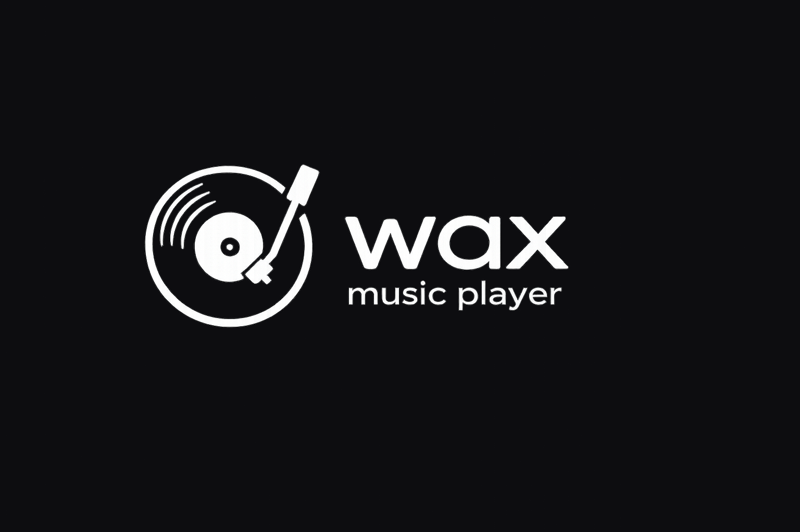

# Wax mobile

<p align="center">
  
</p>

<p align="center">
  YouTube → MP3 mobile player. Vue 3 + Vant, packagé en app native iOS + Android via Capacitor.
  Fork mobile-first du projet <a href="https://github.com/dgadacha/wax">dgadacha/wax</a> (desktop, Electron).
</p>

---

## C'est quoi

Une appli musique mobile auto-hébergée qui parle à un backend `server.cjs` (Express + `yt-dlp` + `ffmpeg`) déployé en k8s. L'app cherche sur YouTube, stream les pistes, télécharge en MP3, gère favoris / playlists / albums / mix.

Le **frontend** vit dans ce repo et est packagé via Capacitor en `.ipa` / `.apk`. Le **backend** est buildé via le `Dockerfile` à la racine et déployé via les manifests dans `k8s/` (même pattern que [kuro](https://gitlab.com/kidnar/kuro) : registry GitLab + Cloudflare Tunnel + Traefik en LAN).

## Stack

- **Frontend** : Vue 3 + Vite + Pinia + Vant (UI mobile)
- **Wrapping mobile** : Capacitor 6 (iOS + Android)
- **Backend** : Node 20 + Express + `yt-dlp` + `ffmpeg`
- **Déploiement backend** : Docker → registry GitLab → k8s

## Setup

### Prérequis

- Node 20+
- Pour le backend en local : `yt-dlp` + `ffmpeg` (`brew install yt-dlp ffmpeg`)
- Pour build iOS : Xcode 15+
- Pour build Android : Android Studio + JDK 17

### Installation

```bash
git clone https://github.com/dgadacha/wax-mobile.git
cd wax-mobile
npm install
cp .env.example .env   # laisse VITE_API_BASE_URL vide pour le dev local
```

### Lancer en dev (web mobile dans le navigateur)

```bash
# Terminal 1 — backend
node server.cjs

# Terminal 2 — frontend (Vite proxy /api → :3000)
npm run dev
```

Ouvre <http://localhost:5173> et active le mode responsive mobile dans les devtools (Cmd+Opt+M dans Chrome).

### Builder pour iOS / Android

Première fois — ajoute les plateformes natives + applique les patches audio :

```bash
npm run build         # vite → dist/
npx cap add ios       # nécessite Xcode
npx cap add android   # nécessite Android Studio + JDK 17
npm run cap:setup     # applique les patches background audio (idempotent)
```

Ensuite, pour reconstruire et ouvrir Xcode / Android Studio :

```bash
# Pointe l'app vers ton backend déployé
echo "VITE_API_BASE_URL=https://wax-api.nc-maiz.org" > .env

# iOS
npm run ios            # build + cap sync ios + cap:setup + cap open ios

# Android
npm run android        # build + cap sync android + cap:setup + cap open android
```

`npm run cap:setup` exécute `scripts/setup-native.mjs` qui :

- Patche `ios/App/App/Info.plist` → `UIBackgroundModes = [audio]`.
- Patche `ios/App/App/AppDelegate.swift` → `AVAudioSession.setCategory(.playback)` + `beginReceivingRemoteControlEvents()`.
- Patche `android/app/src/main/AndroidManifest.xml` → permissions `WAKE_LOCK`, `FOREGROUND_SERVICE`, `FOREGROUND_SERVICE_MEDIA_PLAYBACK`.

Tous les patches sont idempotents (vérifient un sentinel avant d'agir). `npm run cap:sync` enchaîne `cap sync && cap:setup` pour les ré-appliquer après chaque sync (Capacitor peut régénérer certains fichiers natifs).

## Backend — déploiement k8s

```bash
# Build + push
docker build -t registry.gitlab.com/kidnar/wax:latest .
docker push registry.gitlab.com/kidnar/wax:latest

# Déploiement (ordre conseillé)
kubectl apply -f k8s/namespace.yaml
kubectl apply -f k8s/pvc.yaml
kubectl apply -f k8s/deployment.yaml
kubectl apply -f k8s/service.yaml
kubectl apply -f k8s/ingress.yaml   # LAN seulement, optionnel
```

Le `Deployment` utilise `strategy: Recreate` (la lib JSON est sur un PVC RWO), `imagePullSecrets: gitlab-registry` (à créer une fois avec `kubectl create secret docker-registry gitlab-registry ...`), et expose le port 3000.

## Variables d'environnement

| Variable | Côté | Description |
|---|---|---|
| `VITE_API_BASE_URL` | frontend | URL absolue du backend en prod. Vide en dev. |
| `VITE_DEV_PROXY_TARGET` | frontend, dev | Override de la cible du proxy Vite. Défaut `http://localhost:3000`. |
| `PORT` | backend | Port Express. Défaut 3000. |
| `WAX_LIBRARY_DIR` | backend | Répertoire de la bibliothèque. Défaut `./library`, l'image Docker pointe sur `/data`. |
| `WAX_YT_DLP` | backend | Override du chemin `yt-dlp`. |
| `WAX_FFMPEG` | backend | Override du chemin `ffmpeg`. |

## Installation PWA (sans Xcode)

Pour les utilisateurs qui n'ont pas de Mac : l'app est aussi une PWA installable depuis Safari iOS / Chrome Android sans passer par Xcode.

### Servir la build statique

```bash
echo "VITE_API_BASE_URL=https://wax-api.nc-maiz.org" > .env
npm run build
# dist/ → n'importe quel hébergement statique :
#   Cloudflare Pages / Netlify / Vercel / nginx / Caddy / GitHub Pages
```

### Installer sur iPhone

1. Ouvre l'URL publique dans **Safari** (pas Chrome — Apple bloque l'install PWA sauf depuis Safari)
2. Bouton **Partager** → **Sur l'écran d'accueil**
3. L'icône Wax s'ajoute, l'app s'ouvre en plein écran (sans la barre Safari)

### Installer sur Android

1. Ouvre l'URL dans **Chrome**
2. Menu → **Installer l'application** (ou prompt automatique en bas)
3. L'app s'installe comme un APK natif

### Limites PWA iOS (Safari)

- **Audio en background** : Safari finit par tuer la lecture après quelques minutes en background. Pas de fix possible — c'est un choix Apple. Sur Android Chrome c'est mieux : la lecture continue tant que la notification média est active.
- **Plugins natifs Capacitor** (haptics, filesystem offline, share OS) : non disponibles en PWA — l'app utilise les fallbacks web (vibration API, etc.) qui sont silencieux dans Safari.
- **Offline** : le service worker précache l'app shell (HTML/CSS/JS/icônes), donc l'interface se lance hors-ligne. Mais les requêtes vers le backend (search, library, audio streams) ont besoin du réseau.

Pour la version "vraie app" avec background audio illimité + haptics natifs, il faut passer par Capacitor + Xcode (iOS) ou Android Studio (Android). Voir la section précédente.

## Statut

Pré-1.0, en chantier actif. Le shell mobile + les vues principales sont portées :

- **Multi-profil "Qui écoute ?"** au lancement (façon Netflix). Chaque profil a sa propre bibliothèque + playlists côté backend ; les MP3 téléchargés sont partagés.
- **Tab bar** : Accueil / Rechercher / Bibliothèque / Réglages. Icônes [Lucide](https://lucide.dev).
- **Accueil** : greeting + récemment écoutés + grille "Pour toi" basée sur les mix YouTube de tes favoris.
- **Rechercher** : `van-search` + résultats avec heart pour favoriser, tap pour streamer, action sheet "Lancer un mix basé sur ce titre".
- **Bibliothèque** unifiée façon Spotify/Deezer : chips `Tout` / `Playlists` / `Albums` / `Artistes` / `Titres` qui filtrent une seule liste de cards. Tap → vue détail.
- **Détails** (Playlist / Album / Artiste / Mix) : hero Spotify-like (cover en grand + backdrop flouté + play FAB), tracklist, action sheets pour les actions secondaires (renommer, télécharger, sauvegarder en playlist, lancer un mix, etc.).
- **Player** : mini bar persistante + plein écran avec cover, slider de seek, prev/next, like, lyrics.
- **Réglages** : profil actif + sélecteur de couleur d'accent (8 swatches), Favoris/Playlists counts, danger zone (Tout effacer).
- **Safe areas** iOS notch + Android cutout gérées (viewport-fit=cover + Vant safe-area-inset props + StatusBar overlay Capacitor).
- **Background audio** iOS + Android prêt : Info.plist + AVAudioSession + remote control events côté iOS ; permissions WAKE_LOCK + FOREGROUND_SERVICE_MEDIA_PLAYBACK côté Android. Patches appliqués via `npm run cap:setup` (idempotent).

Pas encore : drag-reorder dans les playlists, settings avancés (thème complet 22 variantes / langue / EQ / backup), offline via Capacitor filesystem. Voir `CLAUDE.md` pour le détail.

## Licence

MIT — voir `LICENSE`.
